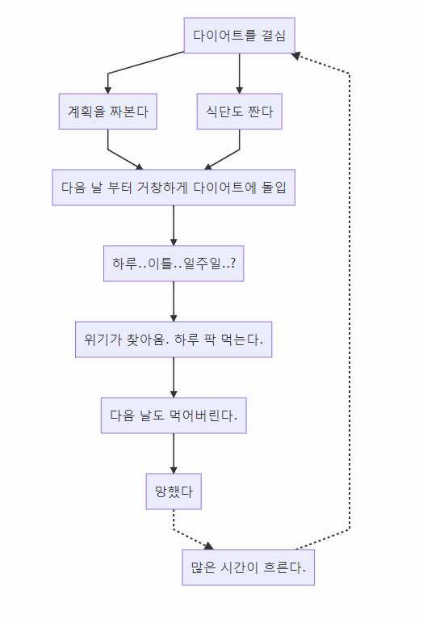

# 프로그래머는 다이어트를 어떻게 할까요?

## 도입

[체지방 제거 및 데피니션 증가를 위한 영양섭취](https://talk.monsterzym.com/index.php?mid=nutrition&search_keyword=%EC%B9%BC%EB%A1%9C%EB%A6%AC&search_target=content&page=3&document_srl=607308)

우리는 다이어트를 합니다.

다이어트의 사전적 정의는 다음과 같습니다.
> 사전적인 뜻으로는 체중을 줄이거나 건강의 증진을 위하여 제한된 식사를 하는 것.
> 다이어트는 대개 살빼기를 의미하는 것으로 살빼기는 스포츠, 특히 "체급"이 존재하는 종목들에서 말하는 체중 감량과는 다르게 필요(need)해서가 아니라 원해서(want) 지방을 줄이고 체중을 줄이는 행위를 일컫는다.

월 초, 신년이 되면 우리는 다음과 같은 프로세스로 다이어트를 시작합니다.

이유는?

1. 세상에는 너무 맛있는게 많다.
2. 술자리도 많다.

다이어트를 하다보면 스트레스를 많이 받는다. **나는 먹고 싶은거 다 먹으면서 다이어트를 하고싶다.**

하지만, 생각보다 녹녹치 않은 현실. 내가 지금 먹고 있는 닭 다리는 몇 칼로리? 영양 밸런스는 어떻게 될까? 머리가 아파 온다.

## 목표

우리가 추구하는 목표는 다음과 같습니다.

1. 먹고 싶은 것을 다 먹으면서 다이어트를 하고 싶다.
2. ~~_하지만, 영양 밸런스도 챙기고 싶다._~~
3. 주 단위, 월 단위 플랜
4. 히스토리

## 진행 상황

## TODO
